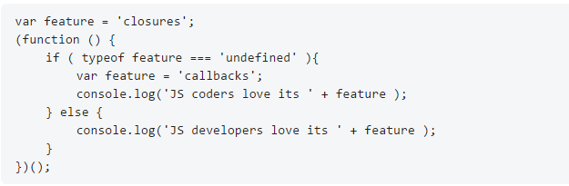

# ejer2_leccion20
Modificar el siguiente script usando closures para que se ejecute sin problemas.
El código muestra el mensaje JS coders love its callbacks, mientras que el resultado debería ser JS developers love its closures. 
Nota: Solo modificar una línea para que se obtenga el resultado deseado.
Al subir a GitHub, indicar el motivo por el que está mostrando el primer mensaje en el README.md.
var num2 = 0;

Elimino : var feature = 'callbacks';
Para que no cumpla la condición typeof feature === 'undefined' y  lea el mensaje console.log('JS developers love its ' + feature );